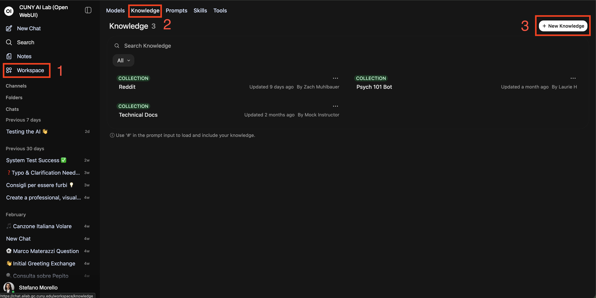

# CLAUDE.md

This file provides guidance to Claude Code (claude.ai/code) when working with code in this repository.

## Important Rules

- **Always use the frontend-design skill when making changes that impact aesthetics.** This applies to any visual/styling modifications.
- **All changes must be accessible by default.** Every new slide, component, or interactive element must meet WCAG 2.1 AA. This is not optional and not a follow-up task.
- **Never use Co-Authored-By lines in commits.**

## Project Overview

Workshop 2 of a 3-part CUNY AI Lab faculty series (system prompts → knowledge collections → agentic tools). Single-page HTML slide deck (30 slides), no build system, no npm dependencies — open `index.html` directly in a browser.

- **Live:** https://cuny-ai-lab.github.io/knowledge-collections/
- **Deployed via:** GitHub Pages from `main` branch (root `/`)
- **Sibling repo (Workshop 1):** https://github.com/cuny-ai-lab/system-prompting — shares the same deck engine, CSS, and JS; content conventions should stay consistent across both

## Viewing & Developing

```bash
# Open locally
open index.html

# Navigate: arrow keys / spacebar, Esc for overview, Home/End for first/last
# Hash routing: index.html#/5 jumps to slide 5

# Deploy: push to main — GitHub Pages rebuilds automatically
git push origin main
```

No build step, no linting, no tests. The HTML file is the source of truth.

## Architecture

Custom deck engine, no framework.

**Entry point:** `index.html` — all slides are `.slide` divs inside `#deck`. Slide content is the source of truth; `SLIDES.md` is a markdown mirror kept in sync manually after edits.

**JS modules** (loaded at bottom of `index.html` in this order):
1. `js/tabs.js` — tab component
2. `js/carousel.js` — auto-advancing image carousel; exposes `window.startCarousel`, `window.pauseCarousel`
3. `js/scrubber.js` — scrubber timeline in the nav bar with ARIA slider keyboard support; exposes `window.updateScrubber(current, total)`
4. `js/deck-engine.js` — core navigation with focus management and live-region announcements; exposes `window.deckEngine`, `window.goTo`, `window.next`, `window.prev`

**CSS files:**
- `css/styles.css` — layout, components, typography, design tokens (`:root` variables), `.sr-only` utility, focus-visible styles
- `css/responsive.css` — breakpoint overrides (1024px, 768px, 480px)
- `css/animations.css` — `@keyframes` definitions (`flow-pulse`, `fadeIn`), `prefers-reduced-motion` override

**Inline script** in `index.html` (before JS tags): `copyTemplate(id)` — clipboard copy for exercise templates.

**Images:** All image assets live in `images/`. Screenshots use `slide{N}-{letter}.png` naming (e.g., `slide4-a.png`).

## Deck Structure

The deck follows this arc:

1. **Title + Roadmap** (slides 1-2)
2. **Model Setup** (slides 3-5) — sign in, create model card, test in chat, condensed pre-flight
3. **What / Where / Why / Upload** (slides 6-9) — what a knowledge collection is, where it lives, why it matters, what you can upload
4. **How Retrieval Works** (slide 10) — RAG explanation with flow diagram
5. **Part I: What Makes a Good Collection?** (slides 11-22) — three discipline examples (Composition, History, Literature), each with weak → getting warmer → strong progression
6. **Part II: Best Practices & Pitfalls** (slides 23-24) — curation guidelines and common mistakes
7. **Part III: Hands-On Exercise** (slides 25-28) — three-step guided build (Course Framework, Assignment Materials, Source Materials) with copyable templates
8. **Prompt + Collection / Closing** (slides 29-30)

## Slide Layouts

Each slide uses one layout class:
- `layout-split` — two-column: `.content` (left, light) + `.stage` (right, panel)
- `layout-content` — single-column, light background
- `layout-full-dark` — centered, dark background
- `layout-divider` — section break, dark, centered large heading
- `layout-grid` — light background with `.grid-2` card layout

## Progressive Reveal

Two mechanisms, both managed by `deck-engine.js`:

1. **Step reveal** — elements with `class="step-hidden" data-step` are revealed one at a time on forward advance. Reset when leaving the slide.
2. **Stream bullets** — `<ul class="stream-list">` items animate in with staggered delay (200ms + 250ms per item) when the slide becomes active.

## Accessibility

This deck targets WCAG 2.1 AA. All changes must preserve these guarantees:

**Slide semantics:** Every `.slide` div has `role="group" aria-roledescription="slide" aria-label="Slide N: Title" tabindex="-1"`. The `#deck` container has `role="region" aria-roledescription="slide deck"`. When adding a new slide, include all four attributes.

**Live announcements:** `#slide-announce` is an `aria-live="polite"` region. `deck-engine.js` updates it on every navigation so screen readers announce the current slide.

**Focus management:** `goTo()` moves focus to the active slide. Inactive slides get `aria-hidden="true"`.

**Scrubber:** The `#scrubber-container` is an ARIA slider (`role="slider"`) with keyboard support (Arrow, Home, End). `aria-valuenow` and `aria-valuetext` are updated on every navigation.

**Navigation bar:** Uses `<nav>` with `aria-label="Slide navigation"`.

**Reduced motion:** `css/animations.css` includes a `prefers-reduced-motion: reduce` media query that disables all animations and transitions.

**Contrast:** `--light-text-50` is set to `0.65` opacity (not `0.5`) to meet AA on dark backgrounds. Never use `opacity` below `0.65` on text containers over dark backgrounds.

**Decorative content:** Emoji icons used as visual decoration must have `aria-hidden="true"`. Decorative SVGs (arrows in flow diagrams) must have `aria-hidden="true"` and `focusable="false"`. Progression dots have `aria-hidden="true"`.

**Hidden content:** `.step-hidden` uses both `opacity: 0` and `visibility: hidden` so unrevealed content is hidden from screen readers. `.sr-only` is the utility for visually-hidden, screen-reader-accessible text.

## Carousel

To add a screenshot carousel in a `.stage` panel:

```html
<div class="carousel" data-interval="8000">
  <div class="carousel-item active">
    
    <div class="carousel-caption"><strong>Bold Title</strong><br>Explanatory text describing what the screenshot shows.</div>
  </div>
  <!-- more carousel-items... -->
  <div class="carousel-dots"></div>
</div>
```

`carousel.js` auto-generates dots, prev/next arrows, and ARIA labels. First item must have `class="carousel-item active"`. Caption style: bold step title, `<br>`, then descriptive sentence referencing UI elements by name in `<strong>` tags.

## Design Tokens

All colors are CSS custom properties in `css/styles.css`:
- Backgrounds: `--bg-light`, `--bg-panel`, `--dark-bg`, `--dark-bg-lighter`, `--code-bg`
- Text: `--text-dark`, `--text-muted`, `--light-text`, `--light-text-50`
- Accents: `--accent-navy`, `--accent-blue`, `--accent-cyan`, `--accent-light-blue`, `--accent-red`, `--accent-amber`, `--accent-green`

Typography: `Fraunces` (headings), `DM Sans` (body), `JetBrains Mono` (code/prompts). All loaded from Google Fonts CDN.

## Conventions

- No em dashes (`—`) anywhere in slide content
- All three discipline examples follow: weak → getting warmer → strong progression
- Knowledge collection examples must frame the instructor as the curator, not students uploading their own work
- Hands-on exercise slides (Part III): template in the stage panel first, "Your turn" tip-box after
- `SLIDES.md` must be kept in sync with `index.html` after every content edit
- Commit messages: short, lowercase, no sign-off
- Prompt blocks use `.prompt-bad` / `.prompt-mid` / `.prompt-good` with matching `.prompt-label` badges
- Logo watermark is hidden on title (first) and closing (last) slides via `deck-engine.js`
